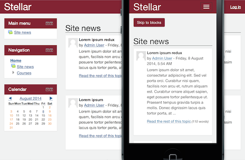

About this theme
================

This is a child theme of Bootstrap for Moodle. Its design is based on the earlier fixed-width Cosmic and Rocket themes.

* package	Stellar theme
* copyright	2014 Lafayette College ITS
* authors	Charles Fulton, Jason Alley, Erwin Annulyse
* license	http://www.gnu.org/copyleft/gpl.html GNU GPL v3 or later

This theme is a child theme of the Moodle Bootstrap 3 theme and that theme is required.

For more information on Bootstrap 3 themes please see https://github.com/bmbrands/theme_bootstrap/blob/master/README.md.

Features
========
Stellar is a fully responsive Bootstrap 3 theme. Added features include:

* A clean, tight design
* On mobile, a top-level block which allows users to skip past the main content region
* A styled breadcrumb bar with integrated full screen and editing buttons

Modify this theme
=================
This theme contains all the less files necessary to recompile the CSS. This theme was developed using the gulp task runner: http://gulpjs.com/. Please see `gulpfile.js` for associated tasks. To recompile the CSS, make the changes in the associated less files and then run `gulp styles`.

